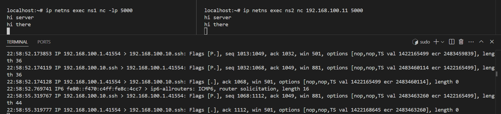

# QEMU cluster

* Goal 1: Create and connect multiple Qemu nodes
* Goal 2: Create and connect multiple netns inside Qemu nodes

## Goal 1: Create and connect multiple Qemu nodes


### boot Qemu node using alpine image

```shell
# create virtual disk
qemu-img create -f qcow2 alpine.qcow2 1G
```

```shell
# boot from iso image
# `-boot d` means boot from cdrom
qemu-system-x86_64 \
  -boot d \
  -cdrom alpine-standard-3.22.0-x86_64.iso \
  -m 512 \
  -hda alpine.backing.qcow2 \
  -nographic \
  -enable-kvm
```

```shell
# boot from backing file
# `-boot c` means boot from disk
qemu-system-x86_64 \
  -boot c \
  -m 512 \
  -hda alpine.backing.qcow2 \
  -nographic \
  -enable-kvm
```

* Note:
    * must run `setup-alpine` in order to install bootable disk
    * chose `sda` -> `sys` -> (y) for erasing the disk

### create Overlay image

```shell
# create overlay image
qemu-img create -f qcow2 -b alpine.backing.qcow2 -F qcow2 alpine.overlay.img
```

```shell
# boot from overlay image
qemu-system-x86_64 \
  -m 512 \
  -hda alpine.overlay.img \
  -enable-kvm \
  -boot c \
  -nographic
```

### using `screen` to store QEMU consoles

```shell
# create session
screen -S qemu
#
# boot from overlay
#

# detach: Ctrl + A, then D

# attach: 
screen -r qemu

```

### connect multiple QEMU nodes

```shell
# create bridge
sudo ip link add name br0 type bridge
sudo ip addr add 192.168.100.1/24 dev br0
sudo ip link set br0 up

# config iptables for br0
iptables -I FORWARD -p all -i br0 -j ACCEPT
iptables -I INPUT -p all -i br0 -j ACCEPT
iptables -I OUTPUT -p all -i br0 -j ACCEPT

# create tap device
sudo ip tuntap add dev tap0 mode tap user $USER
sudo ip link set tap0 master br0
sudo ip link set tap0 up
```

```shell
# boot from overlay & plugin the tap
qemu-system-x86_64 \
  -m 512 \
  -hda alpine.overlay.qcow2 \
  -netdev tap,id=net0,ifname=tap0,script=no,downscript=no \
  -device e1000,netdev=net0 \
  -enable-kvm \
  -nographic

# setup interface 
# Interface: eth0
# IP: 192.168.100.10
# Gateway: 192.168.100.1
setup-interfaces

# assign ip 
ip addr add 192.168.100.10/24 dev eth0
```

* Note:
    * MAC address is auto generated
    * E.g: `52:54:00:12:34:56`
        * where `52:54:00` is Qemu prefix

### create netns node inside QEMU

```shell
# another overlay image for netns
qemu-img create -f qcow2 -b alpine.overlay.qcow2 -F qcow2 alpine.overlay.tap0.qcow2
qemu-img create -f qcow2 -b alpine.overlay.qcow2 -F qcow2 alpine.overlay.tap1.qcow2
```

* Create multiple qemu node

```shell
# node 0
qemu-system-x86_64 \
-m 512 \
-hda alpine.overlay.tap0.qcow2 \
-netdev tap,id=net0,ifname=tap0,script=no,downscript=no \
-device e1000,netdev=net0,mac=52:54:00:00:00:01 \
-enable-kvm \
-nographic
```

```shell
# node 1

# create tap1 device
sudo ip tuntap add dev tap1 mode tap user $USER
sudo ip link set tap1 master br0
sudo ip link set tap1 up

# boot node 1
qemu-system-x86_64 \
-m 512 \
-hda alpine.overlay.tap1.qcow2 \
-netdev tap,id=net1,ifname=tap1,script=no,downscript=no \
-device virtio-net-pci,netdev=net1,mac=52:54:00:00:00:02 \
-enable-kvm \
-nographic

# change ip address to 192.168.100.20
vi /etc/network/interfaces
service networking restart
```

* Now we have 2 Qemu nodes.
    * Node 0 with IP 192.168.100.10
    * Node 1 with IP 192.168.100.20
    * 2 Nodes connect with brigde `br0` via tap devices
    * 2 Nodes can ping eachother

```shell
# from node 0
localhost:~# ip addr show eth0
2: eth0: <BROADCAST,MULTICAST,UP,LOWER_UP> mtu 1500 qdisc pfifo_fast state UP 0
    link/ether 52:54:00:00:00:01 brd ff:ff:ff:ff:ff:ff
    inet 192.168.100.10/24 scope global eth0
       valid_lft forever preferred_lft forever
    inet6 fe80::5054:ff:fe00:1/64 scope link 
       valid_lft forever preferred_lft forever
localhost:~# ping 192.168.100.20
PING 192.168.100.20 (192.168.100.20): 56 data bytes
64 bytes from 192.168.100.20: seq=0 ttl=64 time=0.259 ms
64 bytes from 192.168.100.20: seq=1 ttl=64 time=0.288 ms
64 bytes from 192.168.100.20: seq=2 ttl=64 time=0.287 ms
```

```shell
# from node 1
localhost:~# ip a show eth0
2: eth0: <BROADCAST,MULTICAST,UP,LOWER_UP> mtu 1500 qdisc pfifo_fast state UP 0
    link/ether 52:54:00:00:00:02 brd ff:ff:ff:ff:ff:ff
    inet 192.168.100.20/24 scope global eth0
       valid_lft forever preferred_lft forever
    inet6 fe80::5054:ff:fe00:2/64 scope link 
       valid_lft forever preferred_lft forever
localhost:~# ping 192.168.100.20
PING 192.168.100.20 (192.168.100.20): 56 data bytes
64 bytes from 192.168.100.20: seq=0 ttl=64 time=0.030 ms
64 bytes from 192.168.100.20: seq=1 ttl=64 time=0.035 ms
64 bytes from 192.168.100.20: seq=2 ttl=64 time=0.035 ms
```


## Goal 2: Create and connect multiple netns inside Qemu nodes


### install iproute2

* The iproute2 package in base ISO image does not provide `netns` option.
  * So, we will download the full version of iproute2 from [alpine CDN](https://dl-cdn.alpinelinux.org/alpine/edge/main/x86_64/)
  ```shell
    # download package
    wget https://dl-cdn.alpinelinux.org/alpine/edge/main/x86_64/libelf-0.193-r0.apk
    wget https://dl-cdn.alpinelinux.org/alpine/edge/main/x86_64/libmnl-1.0.5-r2.apk
    wget https://dl-cdn.alpinelinux.org/alpine/edge/main/x86_64/iproute2-minimal-6.15.0-r0.apk
    wget https://dl-cdn.alpinelinux.org/alpine/edge/main/x86_64/ifupdown-ng-iproute2-0.12.1-r7.apk
    wget https://dl-cdn.alpinelinux.org/alpine/edge/main/x86_64/libxtables-1.8.11-r1.apk
    wget https://dl-cdn.alpinelinux.org/alpine/edge/main/x86_64/iproute2-tc-6.15.0-r0.apk
    wget https://dl-cdn.alpinelinux.org/alpine/edge/main/x86_64/iproute2-ss-6.15.0-r0.apk
    wget https://dl-cdn.alpinelinux.org/alpine/edge/main/x86_64/iproute2-6.15.0-r0.apk
  ```

  ```shell
  # move to Node0
  scp *.apk root@192.168.100.10:/root

  # 
  ssh root@192.168.100.10
  apk add --allow-untrusted ./*.apk

  # now `ip netns` is ready to use
  ```

### create netns

* Setting up netns like this:

  


  ```shell
  # Configuration
  PHY_IF="eth0"
  NET1="ns1"
  NET2="ns2"
  IP1="192.168.100.11/24"
  IP2="192.168.100.12/24"
  GW="192.168.100.1"

  # Enable IP forwarding
  echo 1 > /proc/sys/net/ipv4/ip_forward

  # Create network namespaces
  ip netns add $NET1
  ip netns add $NET2

  # Create macvlan interfaces linked to $PHY_IF
  ip link add macvlan1 link $PHY_IF type macvlan mode bridge
  ip link add macvlan2 link $PHY_IF type macvlan mode bridge

  # Assign interfaces to namespaces
  ip link set macvlan1 netns $NET1
  ip link set macvlan2 netns $NET2

  # Bring up interfaces inside namespaces
  ip netns exec $NET1 ip addr add $IP1 dev macvlan1
  ip netns exec $NET2 ip addr add $IP2 dev macvlan2
  ip netns exec $NET1 ip link set dev macvlan1 up
  ip netns exec $NET2 ip link set dev macvlan2 up

  # loopback up
  ip netns exec $NET1 ip link set lo up
  ip netns exec $NET2 ip link set lo up
  ```

* Now the 2 netns can ping each other:

  ```shell
  localhost:~# ip netns exec ns1 ping 192.168.100.12
  PING 192.168.100.12 (192.168.100.12): 56 data bytes
  64 bytes from 192.168.100.12: seq=0 ttl=64 time=0.033 ms
  64 bytes from 192.168.100.12: seq=1 ttl=64 time=0.040 ms
  ```

* The flow of ICMP package:
  

  * Because macvlan allow each netns has it's own MAC address
    So, bridge `br0` can catch ethenet package send from `ns1` and forward it to `ns2`

  * Using netcat to test the connection between 2 netns.
    * Using tcpdump to see the package is sent to `br0` (192.168.100.1)
  


### create and connect netns(s) from multiple Qemu nodes

  * On Qemu Node2, create 2 netns the same way as we did on Qemu Node1
  * Remember to change IP address of netns  to `.21` and `.22`

  

  * Ping from netns inside Node2 to netns inside Node1

  ```shell
  localhost:~# ip netns exec ns1 ip a
  1: lo: <LOOPBACK,UP,LOWER_UP> mtu 65536 qdisc noqueue state UNKNOWN group default qlen 1000
      link/loopback 00:00:00:00:00:00 brd 00:00:00:00:00:00
      inet 127.0.0.1/8 scope host lo
        valid_lft forever preferred_lft forever
      inet6 ::1/128 scope host proto kernel_lo 
        valid_lft forever preferred_lft forever
  5: macvlan1@if2: <BROADCAST,MULTICAST,UP,LOWER_UP> mtu 1500 qdisc noqueue state UP group default qlen 1000
      link/ether 7a:9c:73:31:91:8e brd ff:ff:ff:ff:ff:ff link-netnsid 0
      inet 192.168.100.21/24 scope global macvlan1
        valid_lft forever preferred_lft forever
      inet6 fe80::789c:73ff:fe31:918e/64 scope link proto kernel_ll 
        valid_lft forever preferred_lft forever
  localhost:~# ip netns exec ns1 ping 192.168.100.11
  PING 192.168.100.11 (192.168.100.11): 56 data bytes
  64 bytes from 192.168.100.11: seq=0 ttl=64 time=0.213 ms
  64 bytes from 192.168.100.11: seq=1 ttl=64 time=0.382 ms
  64 bytes from 192.168.100.11: seq=2 ttl=64 time=0.318 
  ```

  * We can also use `netcat` to let netns inside Node1 talks to netns inside Node2

  * This setup allow the cluster to be able to scale-up