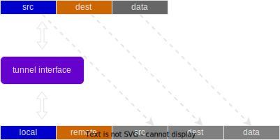

# Tunnel in Linux

Describes linux tunnel in a very easy way to understand.

Tunneling works via encapsulation. A package goes through a tunnel interface will be wrapped inside a larger package.
The new package has new src/dest address. It means, kernel will find a new route for the new package.

Create linux tunnel using iproute2 commands.

