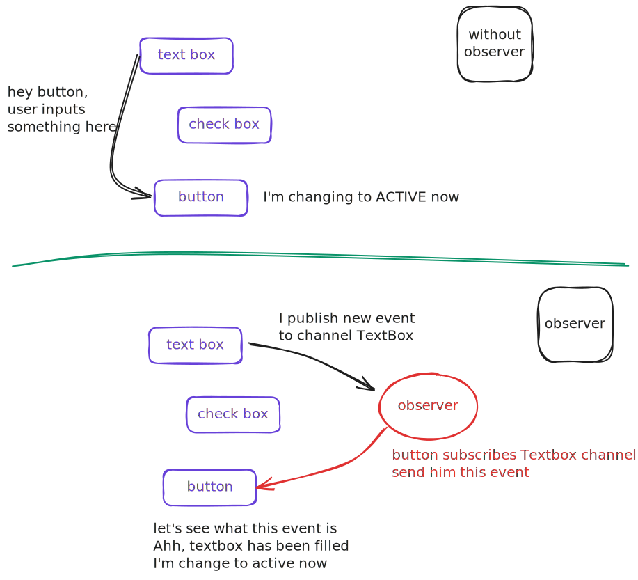
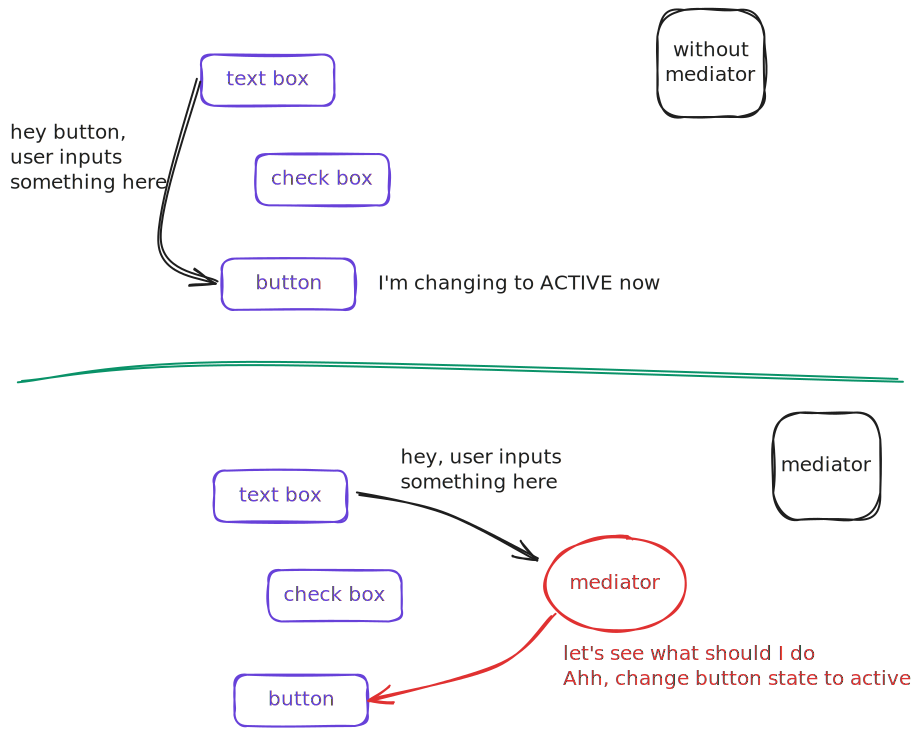
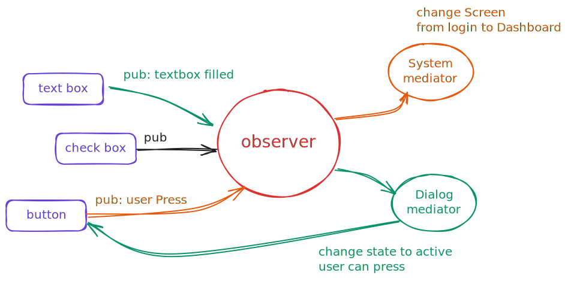

# Observer and Mediator

* Both patterns can be used to handle communication between objects in a decoupled way, preventing them from talking to each other directly.

* So what is the difference?

## Observer

* Forcus on notify event between components

    

## Mediator

* Forcus on coordination of components

    

## Combination of Observer and Mediator

