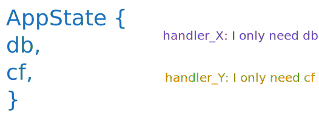
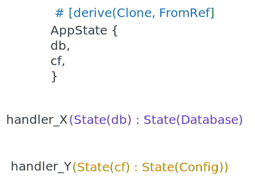

# FromRef


## Rationale

* When using `Axum`, let's declare a `State` like:

    ```rust
    #[derive(Clone)]
    struct AppState {
        db: Database,
        cf: Config,
    }
    ```
* Now, suppose one of your handlers only needs access to `db`.
You could store separate `Arc<Database>` and `Arc<Config>` in the router, but that’s messy.

    

* Instead, you can keep a single shared state `AppState` and tell `Axum` how to get `references` to parts of it — this is where `FromRef` comes in.


## Solution

* Using Axum's macro `FromRef` allows a handler to extract a part of `AppState` in a way that look so easy.

    

* So, how does this magic work under the hood?


## How FromRef is implemented

* The key point is if a handler has an `AppState` — how can it turn that into a `Database`?

* That’s where this trait comes in:
    ```rust
    pub trait FromRef<T> {
        fn from_ref(input: &T) -> Self;
    }
    ```

* De-sugar macro

    ```rust
    #[derive(Clone)]
    struct AppState {
        db: Database,
        ...
    }

    #[derive(Clone)]
    struct Database;

    impl FromRef<AppState> for Database {
        fn from_ref(app_state: &AppState) -> Database {
            app_state.db.clone()
        }
    }
    ```

* Extract state:
    ```rust
    // pseudo - called inside State extractor
    fn extract_state(appState) -> Database {
        db = Database::from_ref(&app_state);
    }
    ```

* Axum uses `.clone()` when extracting subfields. That’s why all `AppState` fields must implement `Clone`

## Nested FromRef

* Imagine you have nested layers of state:

    ```shell
    AppState
    ├── Database
    │    └── Cache
    └── Config
    ```

* Axum can extract `Cache` __in-directly__, if you __manually__ chain `FromRef` implementations:

    * Database can be built from AppState.
    * [Manually add implementation for] Cache can be built from Database.
    ```rust
    cache = Cache::from_ref(&Database::from_ref(&AppState))
    ```

* Generated by Macro
    ```rust
    // 1️⃣ Database from AppState
    impl FromRef<AppState> for Database {
        fn from_ref(app_state: &AppState) -> Database {
            app_state.db.clone()
        }
    }
    ```

* Manually wirtten by you
    ```rust
    // 2️⃣ Cache from Database
    impl FromRef<Database> for Cache {
        fn from_ref(db: &Database) -> Cache {
            db.cache.clone()
        }
    }
    ```

* Now Axum can derive Cache from AppState automatically!
Because it knows `Database::from_ref(AppState)` and `Cache::from_ref(Database)`.

    ```rust
    async fn handler(State(cache): State<Cache>) {
        println!("Cache size: {}", cache.size);
    }
    ```

