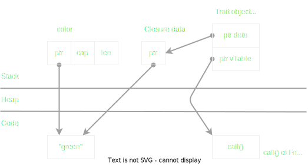
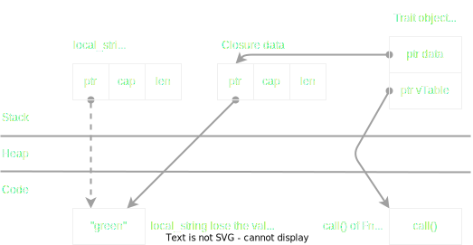

### 1. Closure

* Think of closure as lambdas in C++, or arrow function in JavaScript.

* Closure is a combination of a function and a set of data (captured data).

* Or closure is a Trait object. There are 3 Traits: Fn, FnMut, FnOnce


#### Closure implement Fn trait

* Closure which implements Fn trait uses immutable reference to captures data, that why it can be called multiple times.

```rust
let color = String::from("green");
let print = || println!("color: {}", color);  
// print is a closure
```

```rust
// desugar syntactic:
struct PrintClosure {
    color: & String,
    // borrow **immutable** ownership of the real color value
}
impl Fn for PrintClosure {
    fn call(&self) {
        println!("color: {}", self.color);  
    }
}
```




####  Closure implement FnMut trait

* This kind of closure use mutable reference to capture data.
* When closure is created, we can not create reference to the captured-data until the closure is removed, because Rust allows only 1 mutable reference at a moment.

```rust
let mut count = 0;
let mut inc = || {      // notice: inc is mutable closure
    count += 1;
    println!("count: {}", count);
};
```

```rust
// desugar syntactic:
struct IncClosure {
    count: &mut i32,
    // borrow **mutable** ownership of the count value
}
impl FnMut for IncClosure {
    fn call_mut(&self) {
        println!("color: {}", self.color);  
    }
}
```

####  Closure implement FnOnce trait

* This closure takes ownership of captured-data.

* Approach 1: Use FnOnce closure when the capture data is drop at the first call.

```rust
let movable = Box::new(3);
let consume = || {
    println!("movable: {:?}", movable);
    mem::drop(movable);
};
// from now, movable lost it's value, can not be used
```

```rust
// desugar syntactic:
struct ConsumeClosure {
    movable: Box<i32>,
}
impl FnOnce for ConsumeClosure {
    fn call_once(&self) {
        println!("movable: {:?}", self.movable);
        mem::drop(self.movable);
        // "drop" causes this closure can be called only 1 time.
    }
}
```

* Approach 2: Use the FnOnce closure to capture inner data.

    * For e.g: The **local_string** will outlive the closure returned by create_closure().

```rust
fn create_closure() -> impl Fn() {
    let local_string = String::from("hello");

    // return a closure
    || {
        // compiler might create a Fn closure
        println!("local: ", local_string);
    }

    // local_string is destroyed, the memory which contains "hello" is removed
}

// call closure here return an error
let created_closure = create_closure();
created_closure();   // error
```

* Using **move** to move the value to inside closure, forces closure to take ownership. Also means that compiler will create FnOnce closure


```rust
fn create_closure() -> impl Fn() {
    let local_string = String::from("hello");

    move || {
        println!("local: ", local_string);
    }
}
```

```rust
// desugar syntactic:
struct AnonymousClosure {
    local_string: String,
    // local_string will be move to AnonymousClosure.local_string
}
```


