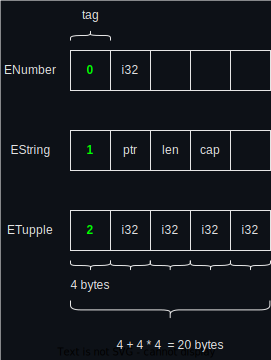

# Enums

Enum in Rust is not just a number that we used to know in some programming languages like C/C++, Java, Js, ...

In Rust, enum is Tagged-Union which provides more usages than just a number.

Let's take a look at what is tagged-union, then discover some extra usages that Rust provides with Enum.

## 1. Enum in C/C++

### 1.1. Enum

Each enum value is just a 4 bytes integer value.
It's often used to mark a number with a more meaning full text.

``` C
enum Level {
  LOW,      // 0
  MEDIUM,   // 1
  HIGH      // 2
};
```

### 1.2. Union

Union value can be different data types. 
Each value has size of the biggest union member.

```C
union CarName {
    char charName,  // use a character as a name
    int intName,    // use a number as a name
    char *strName,  // use a string as a name
}
```

Union is a kind of dangerous feature in C. Because we must remember the data type. 
For example:

```C
    union CarName my_car;
    print("Car name: %s", my_car.intName); // incorrect
```

### 1.3. Tagged union

Tagged union is like a combination of Enum and Union.

```C
struct TaggedUnion {

    int tag;            // indicate the type of _value

    union CarName {
        char charName,  // use a character as a name
        int intName,    // use a number as a name
        char *strName,  // use a string as a name
    } _value;

} value;
```

To use tagged union:
```C
if (value.tag == 0) {
    printf("Car name is a character: %c", value._value.charname);
}
else if (value.tag ==  ...) {
    ...
}
```


It alows writing a user-defined type that:
* Has a tag to indicate which data type it belong to.
* values of same tagged-union type have same size (the biggest)


Advantage: 
* have cheking -> more safety.


Disadvantage:
* still have to remember the data type.
* the checking might have to cover alot of cases.


# 2. Enum in Rust

In Rust, enum is implemented as tagged-union.

``` rust
enum MyEnum {
    ENumber(i32),
    EString(String),
    ETupple(i32, i32, i32, i32),
}
```


Size of an enum is the size of tag pluse size of biggest member.


### 2.1. Nested Enum

### 2.2. Enum usages

#### 2.2.1. Matching pattern

#### 2.2.2 Error handling
