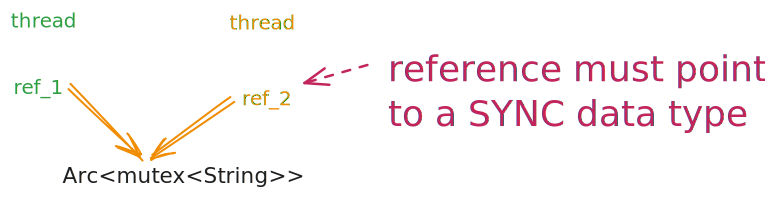

# Brieft introduction to Rust
**ThongDinh -ft- DatDinh**

---
<!-- _class: slide-base invert-->
## Contents

- Get to know Rust
  - History of Rust
  - Notable features
- Get dive deeper to know Rust
  - How Rust archives memory safety

---
<!-- _class: slide-base invert-->
## A. Get to know Rust
  - History of Rust
  - Notable features

---
<!-- _class: slide-base invert-->
## History of Rust
  - When: 2006
  - Who: Graydon Hoare, engineer at *Mozilla Research*
  - What: 
    - Offered high performance of C/C++ 
    - With guaranteed memory safety
  - Which:
    - linux kernel, OS, OS-utilities
    - block chain, wasm
    - backend
    - ...

---
<!-- _class: slide-base invert-->
## Rust inside

---
<!-- _class: slide-base invert-->
## Sponsors

---
<!-- _class: slide-base invert-->
## Notable Features 

---
<!-- _class: slide-base invert-->
## Memory Safety. Rust vs C/C++

- C/C++ easily to have error:
  - dangling pointers:
    - use-after-free
    - double-free
    - buffer overflows

- Rust Compiler:
  - Throws errors on compilation if it detect codes violate it's rules. 
  - Virtually guaranteed to be memory-safe if compile successfully

---
<!-- _class: slide-base invert-->
## Memory Safety. Rust vs Java/Go

- Java/Go use GC:
  - Automatically finds and removes unused objects in the heap.
  - Pros:
    - Ease of Development + Platform Independence
  - Cons:
    - CPU Overhead + Unpredictable Pauses + extra memory for GC (bloat)

- Rust use NO GC:
  - no runtime overhead
  - no extra memory

---
<!-- _class: slide-base invert-->
## Performance

- Build to native machine code --> fast ~ C/C++
- No GC -> faster than Java, Go
- Zero-cost abstraction (same as C++ if not using vtable)
- Fearless concurency by the advantage of Ownership model

---
<!-- _class: slide-base invert-->
## Performance

[source](https://medium.com/star-gazers/benchmarking-low-level-i-o-c-c-rust-golang-java-python-9a0d505f85f7)

---
<!-- _class: slide-base invert-->
## Performance: benchmark vs C

https://programming-language-benchmarks.vercel.app/c-vs-rust

---
<!-- _class: slide-base invert-->
## Performance: benchmark vs GO

[source](https://markaicode.com/rust-vs-go-performance-benchmarks-microservices-2025/?utm_source=chatgpt.com)

---
<!-- _class: slide-base invert-->
## Concurrency
- "Fearless Concurrency":
  - No data race by the advantage of Ownership model
- Offers modern concurrency paradigms:
  - Message passing via Channel
  - async/await

---
<!-- _class: slide-base invert-->
## Speed: concurrent programming

- source: trust me bro

---
<!-- _class: slide-base invert-->
## Take away 1:
- Pros:
    - Guarantee to be memory safe
    - Offer high speed approximate to C/C++
- Cons:
    - Hard to learn at the beginning
    - Compilation cost a lot of time due to checking alot of rules

---
<!-- _class: slide-base invert-->
## B. Dive deeper
  - How Rust archives memory safety

---
<!-- _class: slide-base invert-->
## Memory unsafety in C/C++

---
<!-- _class: slide-base invert-->
## How Rust archives memory safety

---
<!-- _class: slide-base invert-->
## How Rust archives memory safety

---
<!-- _class: slide-base invert-->
## Ownership model

---
<!-- _class: slide-base invert-->
## Ownership model

---
<!-- _class: slide-base invert-->
## Lifetime

---
<!-- _class: slide-base invert-->
## Multithread

---
<!-- _class: slide-base invert-->
## Multithread. Sharing Ownership

---
<!-- _class: slide-base invert-->
## Multithread. Sharing Reference

---
<!-- _class: slide-base invert-->
## Q & A

Thank you !!!