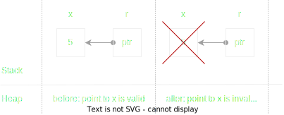

# Lifetimes

Lifetimes of a reference is about:
* What regions of memory a reference could points to ?
* When the regions are valid?

### What regions of memory ?

```rust
fn main() {
    let r;
    {
        let x = 5;
        // before
        r = &x;
    }
    // after
    println!("r: {r}");     // compile error here
}
```




### Lifetime anotation

### Why explicit lifetime needed

```rust
fn longest(x: &str, y: &str) -> &str {
    x
}
...
let output : &str = longest();
```

```rust
fn foo<'a>(x: &'a u32, y: &'a u32) -> &'a u32 {
    if (x > y) {
        x
    }
    else {
        y
    }
}
```

```rust
fn main() {
    let x = 12;
    let z: &u32 = {
        let y = 42;
        foo(&x, &y)
    };
    
    println!("hello world {z}");
}
```
