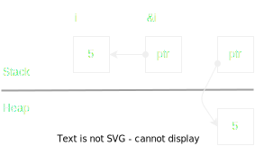
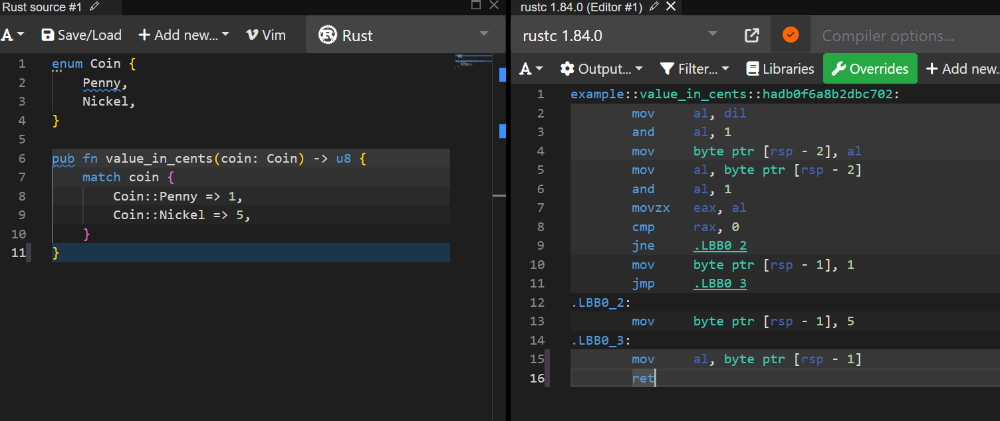
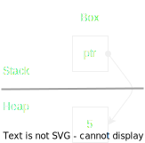
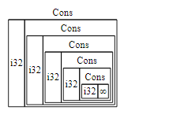

### Struct & tupple
```rust
struct User {
    id: char,
    active: u8,
    age: i32,
    ...
}
```

```rust
// tupple lives on stack
let tupple : (char, u8 i32) = ('a', 100, 500);
```


### Array

``` rust
// array lives on Stack
let array : [i32, 3] = [5, 10, 15];
```


### Reference

* Reference contains an address.
* 8bytes on 64bit OS. 4 bytes on 32bit OS.

* Mutable & Immutable reference are same in memory layout. It's a deference in how they're used.

```rust
let i : i32 = 10;
let ref : &i32 = &i;
```




### Vector


``` rust
let v: Vec<i32> = vec![5, 10, 15];
let sl : &[i32] = &v[0..2];
```


### String

String
* *String* is standard container.

``` rust
let hello_String = String::from("Hello")
```


Literal string
* *str* is rust's core string type.
* Literal string points to data in Code segment
``` rust
let literal_str = "Literal String"
let slice = &literal_str[8..]
// str and slice have same memory layout
```


### Enum
``` rust
// C style enum
enum IP{
	v4,
	v6 = 500,
}

// C style union
union MyTag {
    int i;
    double d;
    char s[16];
}

// Rust style enum: tagged union
enum CarTag{
	TagNumber(i32),
	TagString(String),
}
```


* Size of enum IP is the size of the highest value.

* Size of enum CarTag is the sum of sizes of tag, TagString

* Using smartpoint, e.g: Box, to reduce the size of enum


```rust
enum CarTag{
    ...
	TagBox(Box<String>),    // Box is pointer which is fixed size
    ...
}
```


* Rust automatically optimizes `Options<T>` which contains smart pointer data type (e.g: Box)
```rust
// Option
enum Option<T>{
	None
	Some(T),
}

// Option with smart pointer
let opt: Options<Box<i32>> = Options(Box::new(100)));
```


* In case of optimization Options<T>, the matching pattern works by check if the pointer is NULL or not, corresponding to *None* and *Some*

* Matching pattern with enum is just a comparation of the tag value.




### Box

* Use smart pointer Box<> to store data on Heap

```rust
    let b = Box::new(5);
```




* There a 2 use case:
    * Case 1: Declare a variable which has unknow size at compile time
    ```rust
    trait Vehicle { 
        fn drive(&self);
    }

    let t : dyn Vehicle         // Wrong: declare t as an unknow size data
    let t : Box<dyn Vehicle>;   // Correct: declare t as a pointer which point to trai object in heap
    t = Box::new(Car);
    t.drive();
    ```


    * Case 2: Recursive data type.
    ```rust
    // : 
    enum List {
        Cons(i32, List),        // Wrong: size of List is unknow
        Cons(i32, Box<List>),   // Correct: sizeof Box is known
        Nil,
    }
    ```
    


### Trait behaviors


```rust
// static data types has fixed size -> have copy trait
let a1: i32 = 10;
let a2: i32 = a1;


// Container stores unknow amount of data at compile time -> have move trait
let s1 = String::from("Hello");
let s2 = s1;            // s1 no longer valid


// call clone() to dupplicate the value if the clone function is avaiable
let s2 = s1.clone();    // s1 and s2 both are valid
```


### Trait Object

* Reference or pointer of value, which implement a Trait, is called Trait Object:
```rust
trait Shape {
    fn area(&self);
}

struct Rectangle {
    top_left: ...,
    bottom_right: ...,
}

impl Shape for Rectangle {
    fn area(...)
}

let rec = Rectangle;

let t : dyn Shape;  // Wrong: declare t as an unknow size data
let t : &dyn Shape = &rec;      // Correct
let t : Box<dyn Shape> = &rec;  // Correct
// trait object is known size.
// trait object is a fat pointer which contains 2 other pointers
```


Use trait object for Dynamic dispatching.
[Read more on Trait bound and dispatching ...](../trai_bound_and_dispatching/trai_bound_and_dispatching.md)


### Closure

Rust uses struct to present closure.

```rust
let color = String::from("green");
let print = || println!("color: {}", color);  
// print is a closure

// exec closure:
print()
```


[Read more on closure ...](../closure/closure.md)


### Reference count

* Using RC to have multiple pointers point to the same value


* Data race in multithread:


* Use Atomic Reference Count (Arc) to avoid data race.

    Arc costs small extra performance.

    Both Rc & Arc are immutable. Use mutex to mutate the data.
```rust
let arc_mutext : Arc<Mutex<i32>> = Arc::new(Mutex::new(100))
```


