### 1. Tupple


``` rust
let  a : (char, u8 i32) = ('a', 100, 500);
```
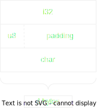


### 1. Array


``` rust
let array : [i32, 3] = [5, 10, 15];
```


### 1. Vector


``` rust
let v: Vec<i32> = vec![5, 10, 15];
let sl : &[i32] = &v[0..2];
```
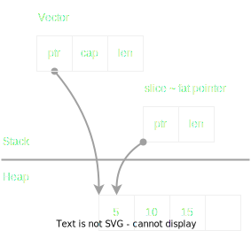


### 1. String

String
``` rust
let hello_String = String::from("Hello")
```
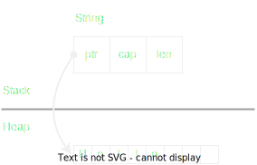


Literal string
``` rust
let literal_str = String::from("Literal String")
let slice = &literal_str[8..]
```
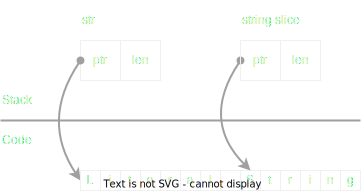


### 1. Struct
```rust
struct User {
    id: char,
    active: u8,
    age: i32,
    ...
}
```
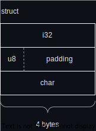


### 1. Enum
``` rust
// C style enum
enum IP{
	v4,
	v6 = 500,
}

// Tagged union enum
enum CarTag{
	TagNumber(i32),
	TagString(String),
}
```
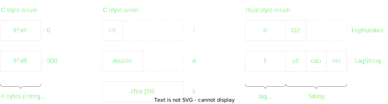

* Size of enum IP is the size of the highest value.

* Size of enum CarTag is the sum of sizes of tag, padding, TagString

* Using smartpoint, e.g: Box, to reduce the size of enum
```rust
enum CarTag{
    ...
	TagBox(Box<String>),    // Box is pointer which is fixed size
    ...
}
```
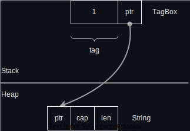


* Rust automatically optimizes Option which contains smart pointer data type (e.g: Box)
```rust
// Option
enum Option<T>{
	None
	Some(T),
}

// Option with smart pointer
let opt: Options<Box<i32>> = Options(Box::new(100)));
```


### 1. Trait behaviors


### 1. Reference count

* Using RC to have:

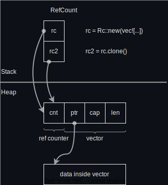

* Data race in multithread:

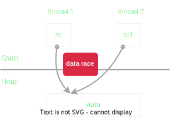

* Use Atomic Reference Count (Arc) to avoid data race.

    Arc costs small extra performance.

    Both Rc & Arc are immutable. Use mutex to mutate the data.
```rust
let arc_mutext : Arc<Mutex<i32>> = Arc::new(Mutex::new(100))
```


### 1. Trait Object


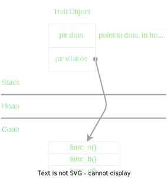


### 1. Closure

Think of closure as lambdas in C++, or arrow function in JavaScript.

Rust uses struct to present closure.

* Imp Fn trait
```rust
let color = String::from("green");
let print = || println!("color: {}", color);  
// print is a closure
```

```rust
// desugar syntactic:
struct PrintClosure {
    color: & String,
    // borrow **immutable** ownership of the real color value
}
impl Fn for PrintClosure {
    fn call(&self) {
        println!("color: {}", self.color);  
    }
}
```

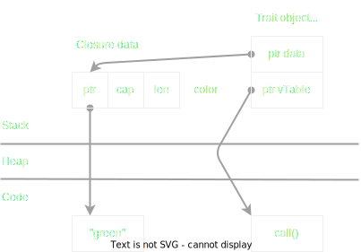


* Imp FnMut trait
```rust
let mut count = 0;
let mut inc = || {      // notice: inc is mutable closure
    count += 1;
    println!("count: {}", count);
};
```

```rust
// desugar syntactic:
struct IncClosure {
    count: &mut i32,
    // borrow **mutable** ownership of the count value
}
impl FnMut for IncClosure {
    fn call_mut(&self) {
        println!("color: {}", self.color);  
    }
}
```

* Imp FnOnce trait
```rust
let movable = Box::new(3);
let consume = || {
    println!("movable: {:?}", movable);
    mem::drop(movable);
};
```

```rust
// desugar syntactic:
struct ConsumeClosure {
    movable: Box<i32>,
}
impl FnOnce for ConsumeClosure {
    fn call_once(&self) {
        println!("movable: {:?}", self.movable);
        mem::drop(self.movable);
        // "drop" causes this closure can be called only 1 time.
    }
}
```


* Using **move** to forces closure to take ownership.

The **local_string** will outlive the closure returned by create_closure().
```rust
fn create_closure() -> impl Fn() {
    let local_string = String::from("hello");

    || {
        println!("local: ", local_string);
    }
}
```

Using **move** to move the value to inside closure
```rust
fn create_closure() -> impl Fn() {
    let local_string = String::from("hello");

    move || {
        println!("local: ", local_string);
    }
}
```

```rust
// desugar syntactic:
struct AnonymousClosure {
    local_string: String,
    // local_string will be move to AnonymousClosure.local_string
}
```