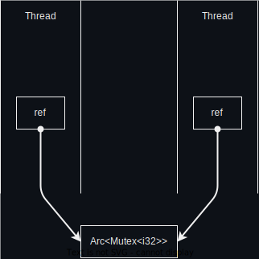
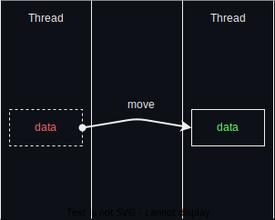

# Send & Sync Trait

Send and Sync are too traits which used to mark a data type.

### What is Sync

A Data type marked as Sync means:
* Multiple threads can use it at same time.

### What is Send

A Data type marked as Send means:
* data can be moved from a thread to another thread.
* Or, multiple threads have chance to hold it. But at a point of time, only one thread uses it.

Ofcouse Sync is Send.
But Send is not Sync.

