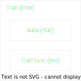

### Trait bound

* Trait is not a type.
* Trait is a bound on type.

```rust
struct Bar;
trait Foo {
    fn foo();
}
impl Foo for Bar {...}
```



Dispatching is how we pass a value, which implement trait, to a function?
    * At runtime, do we know the data type of passed value or not?
    * The value is known size, or un-known size?

Normally, we might write a prototype like bellow, but it not correct in Rust.
```rust
// Compiler doesn't know which struct impl Foo will be passed in
// -> doesn't know size of params
fn my_func(foo: Foo) {      // Wrong: Foo is a trait, not a type
    ...
}
```

There are 2 ways in contrast for dispatching:
    * Static dispatching
    * Dynamic dispatching


### Static dispatching

#### Using generic data types

```rust
// pass by value
fn my_func<T : Foo> (t : T) {}
// pass by reference
fn my_func<T : Foo> (t : &T) {}
// pass by Boxed reference
fn my_func<T : Foo> (t : Box<T>) {}
```

* When to use:
    * when have two params, and both have same Data type.
    Because the data type must be determined at compile time.


#### Using imp Trait

This way is the same as using generic data types.

```rust
// pass by value
fn my_func(t: impl Foo) {}
// pass by reference
fn my_func(t: &impl Foo) {}
// pass by boxed reference
fn my_func(t: Box<impl Foo>) {}
```

* When to use:
    * exactly same as Using generic data types

#### Pros & Cons

Pros:
    * The data type is known at compile time.
    * Member function of data type will be call directly

Cons:
    * Rust uses monomorphization to perform Generic static dispatching.
    It means, in case of using generic data types, if we use my_func() for several concrete types, rust will create several version of my_func() corresponding to each data type.

```rust
struct Bar;
impl Foo for Bar {...}

struct Bazzz;
impl Foo for Bazzz {...}

let bar Bar;
let bazzz = Bazzz;

my_func(bar)
// my_func_bar(t: Bar), a version of my_func for Bar, will be used instead of my_func

my_func(bazzz)
// my_func_bazzz(t: Bazzz), a version of my_func for Bazzz, will be used instead of my_func
```


### Dynamic dispatching

Passing by Trait object.
Trait object is a refrence to instance of data type implemented the trait.

Trait object actually is a fat-pointer, which contains 2 child pointers:
    * Pointer to data
    * Pointer to vTable, which indirectly point to member function of data type.

```rust
pub struct TraitObject {
    pub data: *mut (),      // raw pointer to void (unsafe)
    pub vtable: *mut (),
```

Ref: [Trait Object](https://doc.rust-lang.org/1.8.0/std/raw/struct.TraitObject.html)


```rust
fn my_func(t : &dyn Foo)    // dyn ~ dynamic dispatch
fn my_func(t : &Foo)        // coercing
fn my_func(t : Box<Foo>)    // smart pointer
```


#### Pros & Cons

Pros:
    * Can bring up Polymorphism feature.

Cons:
    * Member function will be call in-directly (2 times de-reference)


### Example

```rust
struct Honda {
    name: String,
    size: i32,
    weight: i32,
    ...
}

trait VehicleAction {
    fn drive()(&self);
}

impl VehicleAction for Honda {
    fn drive(&self) {...};
}

// Static dispatch
fn drive_vehicle_static(vehicle: &impl VehicleAction) {
    vehicle.drive();
}

// dynamic dispatch
fn drive_vehicle_dynamic(vehicle: &dyn VehicleAction) {
    vehicle.drive();
}
```


